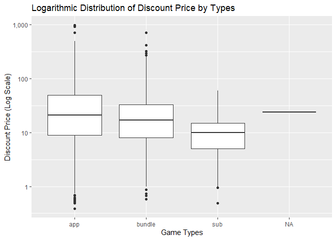
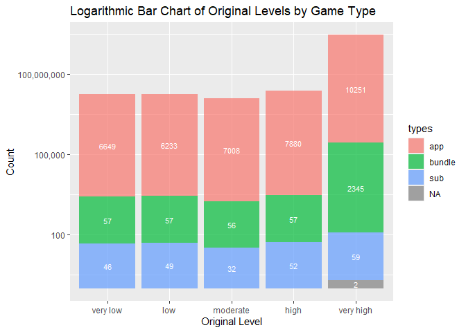
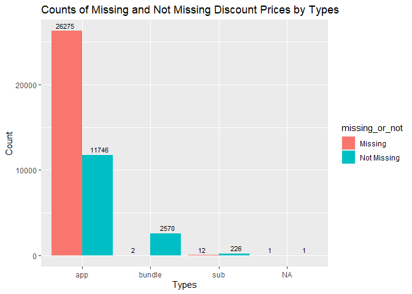
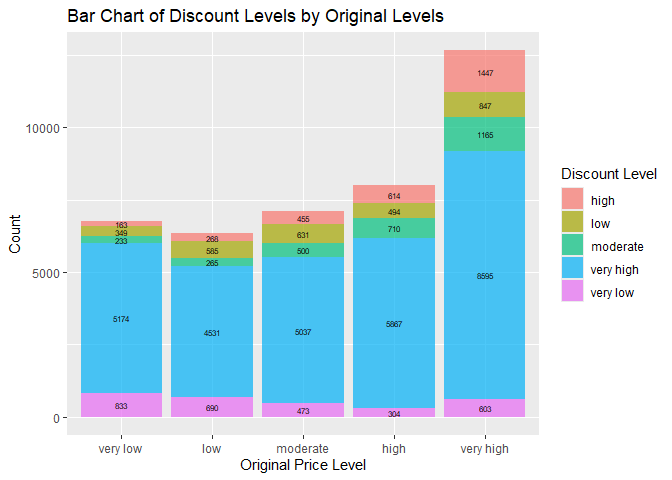

Mini Data Analysis Milestone 2
================

*To complete this milestone, you can either edit [this `.rmd`
file](https://raw.githubusercontent.com/UBC-STAT/stat545.stat.ubc.ca/master/content/mini-project/mini-project-2.Rmd)
directly. Fill in the sections that are commented out with
`<!--- start your work here--->`. When you are done, make sure to knit
to an `.md` file by changing the output in the YAML header to
`github_document`, before submitting a tagged release on canvas.*

# Welcome to the rest of your mini data analysis project!

In Milestone 1, you explored your data. and came up with research
questions. This time, we will finish up our mini data analysis and
obtain results for your data by:

-   Making summary tables and graphs
-   Manipulating special data types in R: factors and/or dates and
    times.
-   Fitting a model object to your data, and extract a result.
-   Reading and writing data as separate files.

We will also explore more in depth the concept of *tidy data.*

**NOTE**: The main purpose of the mini data analysis is to integrate
what you learn in class in an analysis. Although each milestone provides
a framework for you to conduct your analysis, it’s possible that you
might find the instructions too rigid for your data set. If this is the
case, you may deviate from the instructions – just make sure you’re
demonstrating a wide range of tools and techniques taught in this class.

# Instructions

**To complete this milestone**, edit [this very `.Rmd`
file](https://raw.githubusercontent.com/UBC-STAT/stat545.stat.ubc.ca/master/content/mini-project/mini-project-2.Rmd)
directly. Fill in the sections that are tagged with
`<!--- start your work here--->`.

**To submit this milestone**, make sure to knit this `.Rmd` file to an
`.md` file by changing the YAML output settings from
`output: html_document` to `output: github_document`. Commit and push
all of your work to your mini-analysis GitHub repository, and tag a
release on GitHub. Then, submit a link to your tagged release on canvas.

**Points**: This milestone is worth 50 points: 45 for your analysis, and
5 for overall reproducibility, cleanliness, and coherence of the Github
submission.

**Research Questions**: In Milestone 1, you chose four research
questions to focus on. Wherever realistic, your work in this milestone
should relate to these research questions whenever we ask for
justification behind your work. In the case that some tasks in this
milestone don’t align well with one of your research questions, feel
free to discuss your results in the context of a different research
question.

# Learning Objectives

By the end of this milestone, you should:

-   Understand what *tidy* data is, and how to create it using `tidyr`.
-   Generate a reproducible and clear report using R Markdown.
-   Manipulating special data types in R: factors and/or dates and
    times.
-   Fitting a model object to your data, and extract a result.
-   Reading and writing data as separate files.

# Setup

Begin by loading your data and the tidyverse package below:

``` r
library(datateachr) # <- might contain the data you picked!
library(tidyverse)
```

# Task 1: Process and summarize your data

From milestone 1, you should have an idea of the basic structure of your
dataset (e.g. number of rows and columns, class types, etc.). Here, we
will start investigating your data more in-depth using various data
manipulation functions.

### 1.1 (1 point)

First, write out the 4 research questions you defined in milestone 1
were. This will guide your work through milestone 2:

<!-------------------------- Start your work below ---------------------------->

1.  *How are games from different types or publishers discounted?*
2.  *How are games with different original_price ranges distributed
    across types?*
3.  *How do missing values impact the analysis of discount_price in
    Steam games?*
4.  *How do original_price and discount_price relate to each other?*
    <!----------------------------------------------------------------------------->

Here, we will investigate your data using various data manipulation and
graphing functions.

### 1.2 (8 points)

Now, for each of your four research questions, choose one task from
options 1-4 (summarizing), and one other task from 4-8 (graphing). You
should have 2 tasks done for each research question (8 total). Make sure
it makes sense to do them! (e.g. don’t use a numerical variables for a
task that needs a categorical variable.). Comment on why each task helps
(or doesn’t!) answer the corresponding research question.

Ensure that the output of each operation is printed!

Also make sure that you’re using dplyr and ggplot2 rather than base R.
Outside of this project, you may find that you prefer using base R
functions for certain tasks, and that’s just fine! But part of this
project is for you to practice the tools we learned in class, which is
dplyr and ggplot2.

**Summarizing:**

1.  Compute the *range*, *mean*, and *two other summary statistics* of
    **one numerical variable** across the groups of **one categorical
    variable** from your data.
2.  Compute the number of observations for at least one of your
    categorical variables. Do not use the function `table()`!
3.  Create a categorical variable with 3 or more groups from an existing
    numerical variable. You can use this new variable in the other
    tasks! *An example: age in years into “child, teen, adult, senior”.*
4.  Compute the proportion and counts in each category of one
    categorical variable across the groups of another categorical
    variable from your data. Do not use the function `table()`!

**Graphing:**

6.  Create a graph of your choosing, make one of the axes logarithmic,
    and format the axes labels so that they are “pretty” or easier to
    read.
7.  Make a graph where it makes sense to customize the alpha
    transparency.

Using variables and/or tables you made in one of the “Summarizing”
tasks:

8.  Create a graph that has at least two geom layers.
9.  Create 3 histograms, with each histogram having different sized
    bins. Pick the “best” one and explain why it is the best.

Make sure it’s clear what research question you are doing each operation
for!

<!------------------------- Start your work below ----------------------------->

### **How are games from different types or publishers discounted?**

``` r
#Summarizing: #1
discount_types <- steam_games %>%
                  group_by(types) %>%
                  summarise(
                  mean_discount = mean(discount_price, na.rm = TRUE),
                  min_discount = min(discount_price, na.rm = TRUE),
                  max_discount = max(discount_price, na.rm = TRUE),
                  sd_discount = sd(discount_price, na.rm = TRUE)
                  )
print(discount_types)
```

    ## # A tibble: 4 × 5
    ##   types  mean_discount min_discount max_discount sd_discount
    ##   <chr>          <dbl>        <dbl>        <dbl>       <dbl>
    ## 1 app             51.9         0           963.       102.  
    ## 2 bundle          26.9         0.58        708.        35.9 
    ## 3 sub             11.4         0.49         60.0        9.08
    ## 4 <NA>            24.0        24.0          24.0       NA

``` r
#Graphing: #6
ggplot(steam_games, aes(x = types, y = discount_price)) +
  geom_boxplot(na.rm = TRUE) +
  scale_y_log10(labels = scales::comma) +
  labs(
    title = "Logarithmic Distribution of Discount Price by Types",
    x = "Game Types",
    y = "Discount Price (Log Scale)"
  ) +
  theme_bw() 
```

    ## Warning in scale_y_log10(labels = scales::comma): log-10 transformation
    ## introduced infinite values.

<!-- -->

This help to answer the question because it clearly compare the five
number summary of discount for each type of games.

### **How are games with different original_price ranges distributed across types?**

``` r
#Summarizing: #3
original_type <- steam_games %>%
                 group_by(types) %>%
                 mutate(original_level = factor(case_when(
                 original_price < quantile(original_price, 0.2, na.rm = TRUE) ~ "very low",
                 original_price < quantile(original_price, 0.4, na.rm = TRUE) ~ "low",
                 original_price < quantile(original_price, 0.6, na.rm = TRUE) ~ "moderate",
                 original_price < quantile(original_price, 0.8, na.rm = TRUE) ~ "high",
                 TRUE ~ "very high"),
                 levels = c('very low', 'low', 'moderate', 'high', 'very high')))
print(original_type)
```

    ## # A tibble: 40,833 × 22
    ## # Groups:   types [4]
    ##       id url    types name  desc_snippet recent_reviews all_reviews release_date
    ##    <dbl> <chr>  <chr> <chr> <chr>        <chr>          <chr>       <chr>       
    ##  1     1 https… app   DOOM  Now include… Very Positive… Very Posit… May 12, 2016
    ##  2     2 https… app   PLAY… PLAYERUNKNO… Mixed,(6,214)… Mixed,(836… Dec 21, 2017
    ##  3     3 https… app   BATT… Take comman… Mixed,(166),-… Mostly Pos… Apr 24, 2018
    ##  4     4 https… app   DayZ  The post-so… Mixed,(932),-… Mixed,(167… Dec 13, 2018
    ##  5     5 https… app   EVE … EVE Online … Mixed,(287),-… Mostly Pos… May 6, 2003 
    ##  6     6 https… bund… Gran… Grand Theft… NaN            NaN         NaN         
    ##  7     7 https… app   Devi… The ultimat… Very Positive… Very Posit… Mar 7, 2019 
    ##  8     8 https… app   Huma… Human: Fall… Very Positive… Very Posit… Jul 22, 2016
    ##  9     9 https… app   They… They Are Bi… Very Positive… Very Posit… Dec 12, 2017
    ## 10    10 https… app   Warh… In a world … <NA>           Mixed,(904… May 31, 2019
    ## # ℹ 40,823 more rows
    ## # ℹ 14 more variables: developer <chr>, publisher <chr>, popular_tags <chr>,
    ## #   game_details <chr>, languages <chr>, achievements <dbl>, genre <chr>,
    ## #   game_description <chr>, mature_content <chr>, minimum_requirements <chr>,
    ## #   recommended_requirements <chr>, original_price <dbl>, discount_price <dbl>,
    ## #   original_level <fct>

``` r
#Graphing: #6 #7
ggplot(original_type, aes(x = original_level, fill =types)) +
  geom_bar(alpha = 0.7) + 
  scale_y_log10(labels = scales::comma) + 
  geom_text(stat = 'count', aes(label = after_stat(count)), position = position_stack(vjust = 0.5), color = "white", size = 3) +
  labs(
    x = "Original Level",
    y = "Count",
    title = "Logarithmic Bar Chart of Original Levels by Game Type"
  ) 
```

<!-- -->

This help answer the question, because separate original price into 5
levels and draw a graph about this and using color to differentiate the
types. By doing so, we can clearly see the comparison of the number of
different types of games at different original price levels.

### **How do missing values impact the analysis of discount_price in Steam games?**

``` r
#Summarizing: #4
missing_discounts <- steam_games %>%
                      mutate(missing_or_not = factor(case_when(is.na(discount_price) ~ "Missing",
                      TRUE ~ "Not Missing"))) %>%
                      group_by(types, missing_or_not) %>%
                     summarise(count = n())
```

    ## `summarise()` has grouped output by 'types'. You can override using the
    ## `.groups` argument.

``` r
print(missing_discounts)
```

    ## # A tibble: 8 × 3
    ## # Groups:   types [4]
    ##   types  missing_or_not count
    ##   <chr>  <fct>          <int>
    ## 1 app    Missing        26275
    ## 2 app    Not Missing    11746
    ## 3 bundle Missing            2
    ## 4 bundle Not Missing     2570
    ## 5 sub    Missing           12
    ## 6 sub    Not Missing      226
    ## 7 <NA>   Missing            1
    ## 8 <NA>   Not Missing        1

``` r
## Graphing #8
ggplot(missing_discounts, aes(x = types, y = count, fill = missing_or_not)) +
  geom_bar(stat = "identity", position = "dodge") +
  geom_text(aes(label = count), 
            position = position_dodge(width = 1), 
            vjust = -0.5, size = 3) +
  labs(title = 'Counts of Missing and Not Missing Discount Prices by Types',
       x = 'Types',
       y = 'Count')
```

<!-- -->

The results here do not directly answer the research question, but they
help answer it. For example, according to the chart, there are a lot of
missing values in the game type app, so we can guess that the missing
value caused the average value of the overall discount of the app to
drop significantly. For another example, in sub and bundle, the missing
value only accounts for a small part, indicating that the missing value
has little impact on these two categories.

### **How do original_price and discount_price relate to each other?**

``` r
#Summarizing: #4
discount_orginal <- original_type %>%
                    group_by(types) %>%
                    mutate(discount_level = factor(case_when(
                    discount_price < quantile(discount_price, 0.2, na.rm = TRUE) ~ "very low",
                    discount_price < quantile(discount_price, 0.4, na.rm = TRUE) ~ "low",
                    discount_price < quantile(discount_price, 0.6, na.rm = TRUE) ~ "moderate",
                    discount_price < quantile(discount_price, 0.8, na.rm = TRUE) ~ "high",
                                        TRUE ~ "very high"))) %>%
                    group_by(discount_level, original_level) %>%
  summarise(count = n())
```

    ## `summarise()` has grouped output by 'discount_level'. You can override using
    ## the `.groups` argument.

``` r
print(discount_orginal)
```

    ## # A tibble: 25 × 3
    ## # Groups:   discount_level [5]
    ##    discount_level original_level count
    ##    <fct>          <fct>          <int>
    ##  1 high           very low         163
    ##  2 high           low              268
    ##  3 high           moderate         455
    ##  4 high           high             614
    ##  5 high           very high       1447
    ##  6 low            very low         349
    ##  7 low            low              585
    ##  8 low            moderate         631
    ##  9 low            high             494
    ## 10 low            very high        847
    ## # ℹ 15 more rows

``` r
#Graphing: #7 #8
ggplot(discount_orginal, aes(x = original_level, y = count, fill = discount_level)) +
  geom_bar(stat = "identity", alpha = 0.7) +
  geom_text(aes(label = count), 
            position = position_stack(vjust = 0.5), 
             size = 2) +
  labs(
    title = "Bar Chart of Discount Levels by Original Levels",
    x = "Original Price Level",
    y = "Count",
    fill = "Discount Level"
  ) 
```

<!-- -->
When answering this research question, I first made a simple
classification of the discount price and the original price for better
observation. According to the image, the discount distribution becomes
wider as the original price increases, so overall, the higher the
original price, the greater the possibility and magnitude of the
discount. So I think this task helps answer the research question.
<!----------------------------------------------------------------------------->

### 1.3 (2 points)

Based on the operations that you’ve completed, how much closer are you
to answering your research questions? Think about what aspects of your
research questions remain unclear. Can your research questions be
refined, now that you’ve investigated your data a bit more? Which
research questions are yielding interesting results?

<!------------------------- Write your answer here ---------------------------->

**How are games from different types or publishers discounted?**: The
summarized part Calculates the mean, range (minimum and maximum), and
standard deviation of different game types. Combined with the box plot
in the graphing part, we can intuitively see the distribution of
discount prices for different game types. However, the impact of
different publishers on discounts is not reflected. In subsequent
research, we can classify different publishers (due to the large number
of different publishers) to further explore the differences in discount
strategies for different game types and publishers.

**How are games with different original price ranges distributed across
types?**: Dividing the original price into 5 categories helps to see the
price distribution more clearly. By drawing a bar chart and marking the
number of prices at each level, we can more intuitively see how games
with different original price ranges are distributed in each type. Based
on the above results, we may be able to study the reasons for such
differences further. Interesting result: The discount of bundle-type
games is much greater than that of other types of games, which may be to
lure players to buy the game itself.

**How do missing values impact the analysis of discount_price in Steam
games?**: In this section, I visualized the number of missing and
non-missing values for each category of discounted prices using a bar
chart. This can highlight the prevalence of missing data in a particular
category. However, such an operation cannot directly answer the research
question, but can only speculate on the results of the question.
Therefore, in order to further study this issue, I think it is possible
to replace the NA value with other values, such as mean or median, and
then compare the two sets of data images before and after the
replacement. Interesting result: In fact, except for app-type games,
there are very few missing values for discounted prices of other types
of games. If app-type games are excluded, the missing value can be said
to have almost no effect on the discount price.

**How do original_price and discount_price relate to each other?**: In
this section, I classified the discount price and original price
separately, found the discount level in each original level, and
expressed it with a bar chart. This clearly describes how the discount
changes with the original price. However, the study here only studies
the relationship between the two sets of data and does not discuss the
reasons for this result. Therefore, in further research, we can discuss
the factors that cause this result, and even combine it with the
previous question. At the same time, we can also analyze it from the
perspective of the percentage of the discount price to the original
price.

<!----------------------------------------------------------------------------->

# Task 2: Tidy your data

In this task, we will do several exercises to reshape our data. The goal
here is to understand how to do this reshaping with the `tidyr` package.

A reminder of the definition of *tidy* data:

-   Each row is an **observation**
-   Each column is a **variable**
-   Each cell is a **value**

### 2.1 (2 points)

Based on the definition above, can you identify if your data is tidy or
untidy? Go through all your columns, or if you have \>8 variables, just
pick 8, and explain whether the data is untidy or tidy.

<!--------------------------- Start your work below --------------------------->
<!----------------------------------------------------------------------------->

### 2.2 (4 points)

Now, if your data is tidy, untidy it! Then, tidy it back to it’s
original state.

If your data is untidy, then tidy it! Then, untidy it back to it’s
original state.

Be sure to explain your reasoning for this task. Show us the “before”
and “after”.

<!--------------------------- Start your work below --------------------------->
<!----------------------------------------------------------------------------->

### 2.3 (4 points)

Now, you should be more familiar with your data, and also have made
progress in answering your research questions. Based on your interest,
and your analyses, pick 2 of the 4 research questions to continue your
analysis in the remaining tasks:

<!-------------------------- Start your work below ---------------------------->

1.  *FILL_THIS_IN*
2.  *FILL_THIS_IN*

<!----------------------------------------------------------------------------->

Explain your decision for choosing the above two research questions.

<!--------------------------- Start your work below --------------------------->
<!----------------------------------------------------------------------------->

Now, try to choose a version of your data that you think will be
appropriate to answer these 2 questions. Use between 4 and 8 functions
that we’ve covered so far (i.e. by filtering, cleaning, tidy’ing,
dropping irrelevant columns, etc.).

(If it makes more sense, then you can make/pick two versions of your
data, one for each research question.)

<!--------------------------- Start your work below --------------------------->

# Task 3: Modelling

## 3.0 (no points)

Pick a research question from 1.2, and pick a variable of interest
(we’ll call it “Y”) that’s relevant to the research question. Indicate
these.

<!-------------------------- Start your work below ---------------------------->

**Research Question**: FILL_THIS_IN

**Variable of interest**: FILL_THIS_IN

<!----------------------------------------------------------------------------->

## 3.1 (3 points)

Fit a model or run a hypothesis test that provides insight on this
variable with respect to the research question. Store the model object
as a variable, and print its output to screen. We’ll omit having to
justify your choice, because we don’t expect you to know about model
specifics in STAT 545.

-   **Note**: It’s OK if you don’t know how these models/tests work.
    Here are some examples of things you can do here, but the sky’s the
    limit.

    -   You could fit a model that makes predictions on Y using another
        variable, by using the `lm()` function.
    -   You could test whether the mean of Y equals 0 using `t.test()`,
        or maybe the mean across two groups are different using
        `t.test()`, or maybe the mean across multiple groups are
        different using `anova()` (you may have to pivot your data for
        the latter two).
    -   You could use `lm()` to test for significance of regression
        coefficients.

<!-------------------------- Start your work below ---------------------------->
<!----------------------------------------------------------------------------->

## 3.2 (3 points)

Produce something relevant from your fitted model: either predictions on
Y, or a single value like a regression coefficient or a p-value.

-   Be sure to indicate in writing what you chose to produce.
-   Your code should either output a tibble (in which case you should
    indicate the column that contains the thing you’re looking for), or
    the thing you’re looking for itself.
-   Obtain your results using the `broom` package if possible. If your
    model is not compatible with the broom function you’re needing, then
    you can obtain your results by some other means, but first indicate
    which broom function is not compatible.

<!-------------------------- Start your work below ---------------------------->
<!----------------------------------------------------------------------------->

# Task 4: Reading and writing data

Get set up for this exercise by making a folder called `output` in the
top level of your project folder / repository. You’ll be saving things
there.

## 4.1 (3 points)

Take a summary table that you made from Task 1, and write it as a csv
file in your `output` folder. Use the `here::here()` function.

-   **Robustness criteria**: You should be able to move your Mini
    Project repository / project folder to some other location on your
    computer, or move this very Rmd file to another location within your
    project repository / folder, and your code should still work.
-   **Reproducibility criteria**: You should be able to delete the csv
    file, and remake it simply by knitting this Rmd file.

<!-------------------------- Start your work below ---------------------------->
<!----------------------------------------------------------------------------->

## 4.2 (3 points)

Write your model object from Task 3 to an R binary file (an RDS), and
load it again. Be sure to save the binary file in your `output` folder.
Use the functions `saveRDS()` and `readRDS()`.

-   The same robustness and reproducibility criteria as in 4.1 apply
    here.

<!-------------------------- Start your work below ---------------------------->
<!----------------------------------------------------------------------------->

# Overall Reproducibility/Cleanliness/Coherence Checklist

Here are the criteria we’re looking for.

## Coherence (0.5 points)

The document should read sensibly from top to bottom, with no major
continuity errors.

The README file should still satisfy the criteria from the last
milestone, i.e. it has been updated to match the changes to the
repository made in this milestone.

## File and folder structure (1 points)

You should have at least three folders in the top level of your
repository: one for each milestone, and one output folder. If there are
any other folders, these are explained in the main README.

Each milestone document is contained in its respective folder, and
nowhere else.

Every level-1 folder (that is, the ones stored in the top level, like
“Milestone1” and “output”) has a `README` file, explaining in a sentence
or two what is in the folder, in plain language (it’s enough to say
something like “This folder contains the source for Milestone 1”).

## Output (1 point)

All output is recent and relevant:

-   All Rmd files have been `knit`ted to their output md files.
-   All knitted md files are viewable without errors on Github. Examples
    of errors: Missing plots, “Sorry about that, but we can’t show files
    that are this big right now” messages, error messages from broken R
    code
-   All of these output files are up-to-date – that is, they haven’t
    fallen behind after the source (Rmd) files have been updated.
-   There should be no relic output files. For example, if you were
    knitting an Rmd to html, but then changed the output to be only a
    markdown file, then the html file is a relic and should be deleted.

Our recommendation: delete all output files, and re-knit each
milestone’s Rmd file, so that everything is up to date and relevant.

## Tagged release (0.5 point)

You’ve tagged a release for Milestone 2.

### Attribution

Thanks to Victor Yuan for mostly putting this together.
